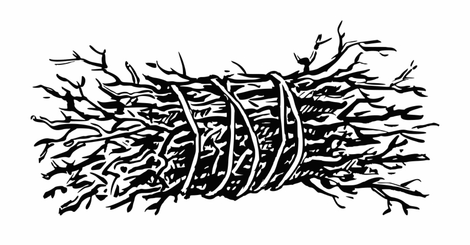

# Twig Bundle Installer plugin for Composer

A Composer plugin that installs & manages Twig Bundles in your `templates/vendor/` directory



## Overview
 
Twig Bundle Installer is a Composer installer that installs and manages Twig Bundles in your `templates/` directory. It introduces the concept of Twig _bundles_ and installs them in `templates/vendor/`, similarly to how you’d normally install PHP packages in `vendor/`. (And it doesn’t change anything about that; your PHP bundles will still live in `vendor`.)
 
It implements a new Composer package type named `twig-bundle`, which should be used when publishing Twig Bundles. Composer manages it all, and Twig Bundle Installer is not tied to any particular CMS or system. Anything that uses Twig might find it useful.

This allows you to install and update Twig templates across multiple projects in a managed way.

## Why Though?

- Stop copying useful bits of Twig between projects; include them easily and keep them *all* up to date.
- Share useful Twig components with other developers and teams in whatever projects you want.
- Reuse these same bits anywhere you use Twig; Craft CMS, Laravel, Statamic, and beyond.
- Improve your documentation once your base components all live together in one place.
- Distribute your Craft plugin’s sample templates in a more convenient, flexible, and versionable way.
- Utilize *template* dependencies as easily as PHP packages.

## Why Twig Bundle Installer?

I'd originally thought of the idea implemented in Twig Bundle Installer when working on re-usable Twig components.

Later the idea came up again when I worked on a base Twig templating layer as discussed in the [An Effective Base Twig Templating Setup](https://nystudio107.com/blog/an-effective-twig-base-templating-setup) article.

Then it idea came up _again_ when discussing with a colleague how they managed multiple brand properties in a large [Craft CMS](https://craftcms.com) install via separate plugins. Each brand site had its own custom plugin which was mostly a wrapper for the templates needed for said site.

So if something comes up 3x or more, I think it's probably worth trying out…

## Using Twig Bundle Installer

### Consuming Twig Bundles

#### Adding Twig Bundles to your Project

To use Twig Bundles in your own project, first you need to add Twig Bundle Installer to your project's `composer.json`:

```json
{
  "require": {
    "nystudio107/twig-bundle-installer": "^1.0.0",
  }
}

```

Then you can add in the vendor/package name of the Twig Bundle you want to use just like you would any Composer package:

```json
{
  "require": {
    "nystudio107/twig-bundle-installer": "^1.0.0",
    "nystudio107/test-twig-bundle": "^1.0.0"
  }
}

```

Then just do a:
```
composer install
```

What Twig Bundle Installer does is for Composer packages that are of the type `twig-bundle` instead of putting them in the `vendor/` directory, it will put them in the `templates/vendor/` directory.

In the above example, you'll end up with something like this:
```
❯ tree -L 4 templates/vendor
templates/vendor
└── nystudio107
    └── test-twig-bundle
        ├── CHANGELOG.md
        ├── composer.json
        ├── LICENSE.md
        ├── README.md
        └── templates
            ├── fizz-buzz.twig
            ├── elementary-my-dear-watson.twig
            └── five-minute-read.twig

3 directories, 8 files
```

This means that you can install & update these Twig Bundles across multiple projects. They can be Twig Bundles you've created, or Twig Bundles others have created.

It works just like any Composer package does, because Twig Bundle Installer is just a layer on top of Composer that routes packages of the type `twig-bundle` to a different directory.

Commands you're used to such as `composer require`, `composer update`, etc. all work as you'd expect.

Example including a template from a Twig Bundle:

```twig

```

#### Twig Bundle Considerations

Since Twig Bundle Installer is looking for a directory in your project root named `templates/` that points to your Twig templates directory:

* If you store your templates somewhere else, for now you must create a symlink or alias from `templates/` to where you store your templates
* If you exclude your `vendor/` directory from your Git repo, you probably would want to add `templates/vendor/` to your `.gitignore` as well

Example `.gitignore` file:
```
/vendor
/templates/vendor
```

#### Local Repositories

If you want to use local Twig Bundles while you work on them, you can do that via the [Composer Repositories](https://getcomposer.org/doc/05-repositories.md) setting:

```json
{
  "require": {
    "nystudio107/bundle-twig-installer": "^1.0.0",
    "nystudio107/twig-test-bundle": "^1.0.0"
  },
  "repositories": [
    {
      "type": "path",
      "url": "../../twig/*",
      "options": {
        "symlink": true
      }
    }
  ]
}

```

Where the `url` setting is a path to where your source Twig Bundles live.


### Creating Twig Bundles

To create a Twig Bundle, create a directory with a `Composer.json` file in it that looks like this:
```json
{
  "name": "nystudio107/test-twig-bundle",
  "description": "Test bundle of Twig templates for Bundle Installer",
  "version": "1.0.0",
  "keywords": [
    "twig",
    "twig-bundle",
    "composer",
    "installer",
    "bundle"
  ],
  "type": "twig-bundle",
  "license": "MIT",
  "minimum-stability": "stable"
}
```

...but obviously change the `name` to your `vendor/bundle` name, and fill in your own description, etc. The key is that you must have the `type` set to `twig-bundle`:

```
  "type": "twig-bundle",
```

You'll then want to publish this to a [GitHub](https://github.com/) or other Git repo, publish it on [Packagist.org](https://packagist.org/) so others can install it via Composer

If you've never published a package on Packagist before, just follow the instructions on [Packagist.org](https://packagist.org/) or read the [Packagist and the PHP ecosystem](https://www.bugsnag.com/blog/packagist-and-the-php-ecosystem) article.

You can use the [Test Twig Bundle](https://github.com/nystudio107/test-twig-bundle) as an example to follow.

## Twig Bundle Installer Roadmap

This project is usable as-is, but it's also very much in the germination phase. I'm curious to see what uses people find for it, or potentially none at all.

Some ideas:

* The templates directory shouldn't be hard-coded
* Bundles could include CSS and JavaScript that the installer builds a `manifest.json` for something else to consume
* Framework specific tools could compliment Twig Bundle Installer by automatically publishing bundles on the frontend
* Technically, the technique described here would work fine for [Antlers](https://docs.statamic.com/antlers) or [Blade](https://laravel.com/docs/5.8/blade) and other templating systems as well.

Brought to you by [nystudio107](https://nystudio107.com/)
